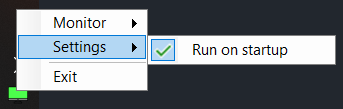

# HdrSwitcher

Minimalistic taskbar tool to track and update HDR mode. Made with .NET 6, utilizes WinAPI

## Installation

- Go to [Releases](https://github.com/Xorboo/HdrSwitcher/releases/latest)
- Download latest `HdrSwitcher.exe`
- Run it (would only add an icon to the taskbar)
- (Optional) Add to autorun

  

## Usage

HdrSwitcher trackes selected monitor state and shows a green/red icon depending on whether HDR is enabled or not.

- Select desired monitor in the context menu

  

- Left-click the icon to toggle HDR mode for the selected monitor

   

## Credits

- Monitor icon based on [xnimrodx](https://www.flaticon.com/authors/xnimrodx) art
